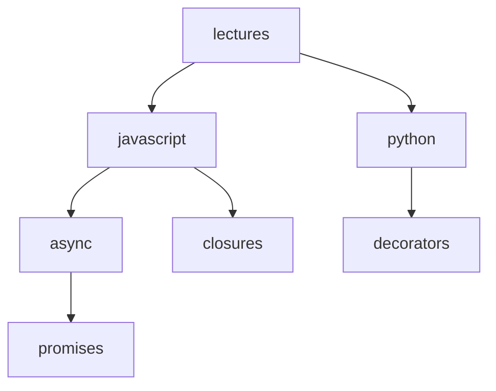

---

# 📘 Dynamic Routes with Catch-All Segments in Next.js

---

## ❓ Problem Statement

मान लो आपके पास एक **Lectures section** है और आपको अलग-अलग topics और subtopics के लिए routes बनाने हैं:

* `/lectures/javascript`
* `/lectures/javascript/async`
* `/lectures/javascript/async/promises`
* `/lectures/python/decorators`

👉 अगर आप हर एक case के लिए अलग-अलग file बनाओगे (`javascript/page.tsx`, `async/page.tsx`, `promises/page.tsx` …),
तो बहुत सारे **nested routes** बन जाएंगे और code **messy** हो जाएगा।

---

## 💡 The Solution: Catch-All Routes

Next.js हमें एक powerful feature देता है → **Catch-All Segments (`[...slug]`)**

इससे आप unlimited nested params को सिर्फ **एक ही `page.tsx`** से handle कर सकते हो।
यानी multiple/nested routes बनाने की जरूरत ही नहीं।

---

## 🚀 Steps to Implement

### 1️⃣ Folder Structure बनाओ

```bash
src > app > lectures
```

### 2️⃣ Catch-All Route Folder बनाओ

```bash
src > app > lectures > [...slug]
```

👉 यहां `[...slug]` का मतलब है कि आप **unlimited params** पास कर सकते हो।

### 3️⃣ Page File बनाओ

```bash
src > app > lectures > [...slug] > page.tsx
```

👉 यही वो file है जो हमेशा render होगी।

---

## 📌 Final Route Example

```
lectures > [...slug] > page.tsx
```

* चाहे आप `/lectures/a` call करो
* या `/lectures/a/b/c`
  👉 हमेशा **page.tsx** ही render होगा।

---

## ⚡ Important Note

* **Square brackets** (`[...slug]`) में जो नाम दोगे, उसी नाम से params को `page.tsx` के अंदर access करना पड़ेगा।
* ये params हमेशा **array of strings** में मिलेंगे।

---

## 📝 Example Code

```tsx
// src/app/lectures/[...slug]/page.tsx

export default async function Lectures({
  params,
}: {
  params: Promise<{ slug: string[] }>;
}) {
  const { slug } = await params;
  console.log(slug);

  if (slug.length == 2) {
    return <div>Lecture 1</div>;
  }

  if (slug.length == 3) {
    return <div>Lecture 3</div>;
  }

  return <div>Lectures</div>;
}
```

---

## 🎯 Output Behavior

* `/lectures/a/b` → renders **Lecture 1**
* `/lectures/a/b/c` → renders **Lecture 3**
* `/lectures/anything` → renders **Lectures**

---

## 🚨 Special Case: No Params

अगर आप सिर्फ `/lectures` पर जाओगे तो by default Next.js **Not Found** error देगा ❌।
लेकिन अगर आप चाहते हो कि **params न होने पर भी वही page.tsx render हो**,

तो बस catch-all folder (`[...slug]`) को एक **optional catch-all route** में बदल दो:

```bash
src > app > lectures > [[...slug]] > page.tsx
```

👉 Notice the **double square brackets** `[[...slug]]`.

अब behavior ऐसे होगा:

* `/lectures` → ✅ renders `page.tsx`
* `/lectures/a/b` → ✅ renders `page.tsx` with params
* `/lectures/a/b/c` → ✅ renders `page.tsx` with params

---

## 🧩 Visual Folder Structure

```
src
 └── app
     └── lectures
         └── [[...slug]]
             └── page.tsx
```

---

## 🖥️ Console Output Example

* `/lectures/a/b/c` →

  ```bash
  ["a", "b", "c"]
  ```

* `/lectures/a` →

  ```bash
  ["a"]
  ```

* `/lectures` →

  ```bash
  []
  ```

---

## 🌍 Real-World Analogy

इसे ऐसे सोचो 👇

* `/lectures` → बस lectures की main library खोली 📚
* `/lectures/javascript` → JavaScript वाला topic खोला 🔑
* `/lectures/javascript/async` → उस topic के अंदर Async subtopic खोला ⚡
* `/lectures/javascript/async/promises` → और deep जाकर Promises वाले notes देख लिए 🔍

👉 हर बार आप **same `page.tsx`** ही render कर रहे हो, लेकिन params की length के हिसाब से अलग content show कर सकते हो।

---

## 🪄 Why This is Powerful

✅ इस approach से आपको हर एक case के लिए **अलग-अलग nested routes बनाने की ज़रूरत नहीं**।
✅ आप सिर्फ एक ही `page.tsx` से **unlimited levels of nesting** handle कर सकते हो।
✅ Code structure clean और scalable बन जाता है।

---

## 🔗 Visual Tree Analogy

```
/lectures
   ├── javascript
   │     ├── async
   │     │     └── promises
   │     └── closures
   └── python
         └── decorators
```

👉 ऊपर के सारे routes सिर्फ **एक ही page.tsx** से handle हो जाएंगे।

---

## 🖼️ Mermaid Flowchart Diagram



👉 इस diagram में दिख रहा है कि `/lectures` से शुरू होकर कितनी भी depth तक जाया जा सकता है,
लेकिन हर बार handle सिर्फ **एक ही `page.tsx`** करेगा।

---


